# 模块图与流程图

## 1. 文档说明

本文档用于以图形化方式展示小Y项目的系统结构、前后端模块划分以及核心业务流程，便于项目汇报、答辩展示、团队沟通和后续维护。

---

## 2. 系统总体模块图

### 2.1 系统总览图

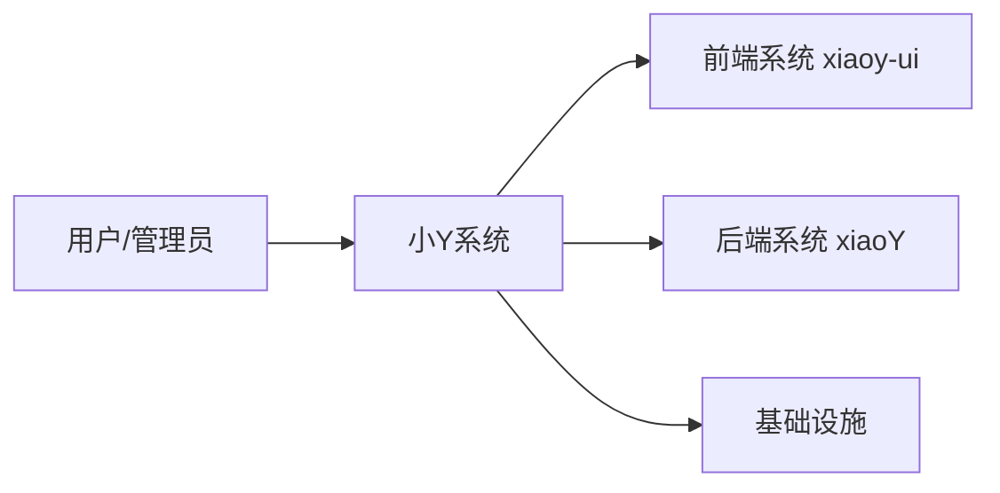

### 2.2 前端子模块图

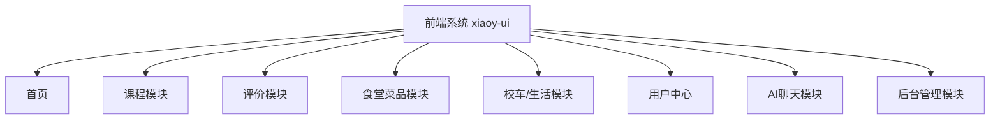

### 2.3 后端子模块图

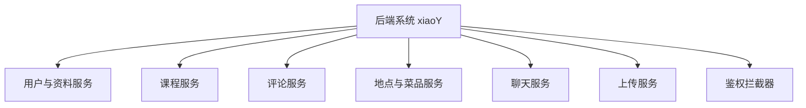

### 2.4 基础设施图

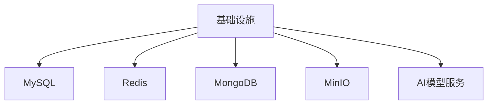

### 说明

- 前端负责页面展示、状态管理和接口调用
- 后端负责业务处理、数据访问、鉴权、上传与AI能力
- MySQL 存储结构化业务数据
- Redis 存储登录态与缓存
- MongoDB 存储聊天记忆与消息历史
- MinIO 存储头像与上传文件
- AI模型服务负责智能问答与流式回复

---

## 3. 前端模块图

### 3.1 前端总览图

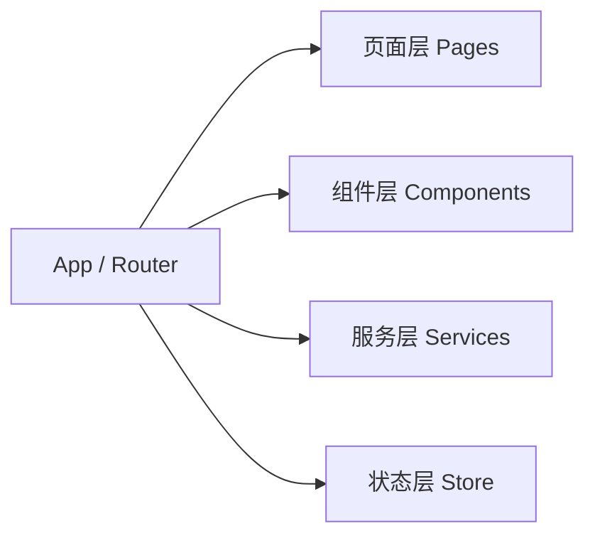

### 3.2 页面层子图

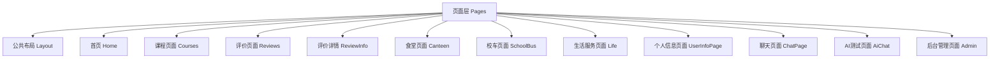

### 3.3 组件层子图

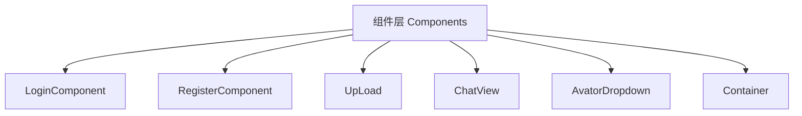

### 3.4 服务层子图

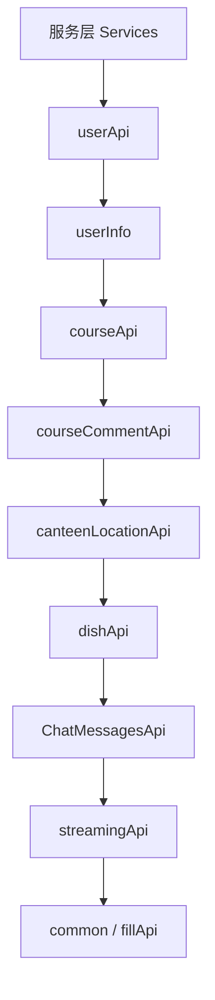

### 3.5 状态层子图

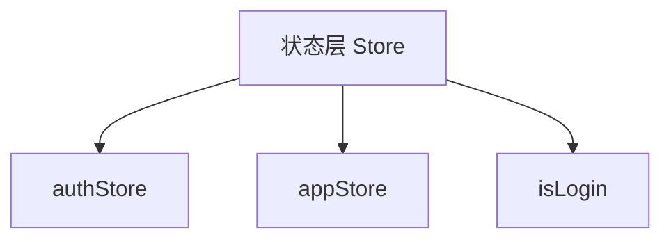

### 说明

- 路由层负责组织页面跳转
- 组件层负责页面复用和交互封装
- 服务层负责统一接口调用
- 状态层负责用户认证状态和全局状态管理

---

## 4. 后端模块图

### 4.1 后端总览图

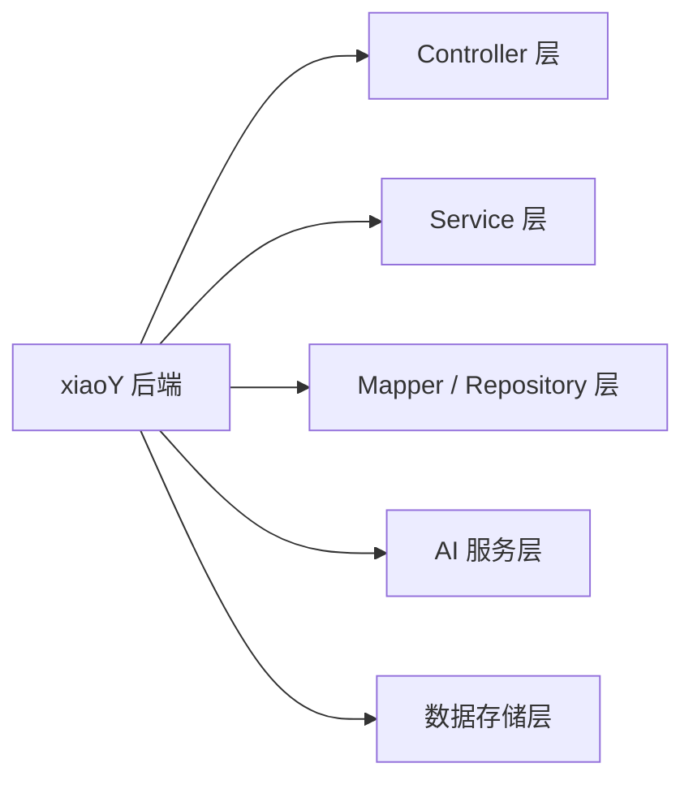

### 4.2 Controller 层子图

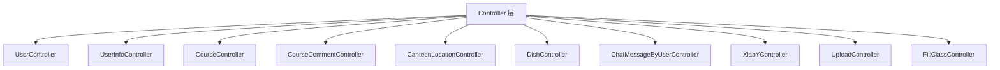

### 4.3 Service 层子图

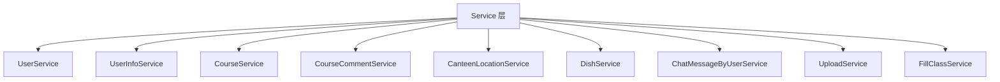

### 4.4 数据访问层子图

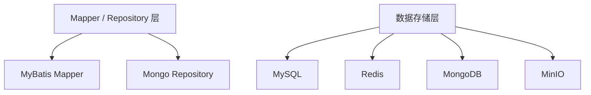

### 4.5 AI 服务层子图

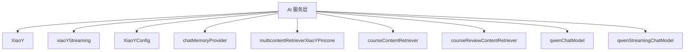

### 说明

- Controller 对外暴露 REST 接口
- Service 承载业务逻辑
- Mapper / Repository 负责访问 MySQL 与 MongoDB
- AI 服务层负责模型调用、会话记忆和内容检索配置
- `chatMemoryProvider`、`contentRetriever`、`streamingChatModel` 等配置支撑 AI 对话能力

---

## 5. 用户端核心流程图

### 5.1 登录与进入系统流程

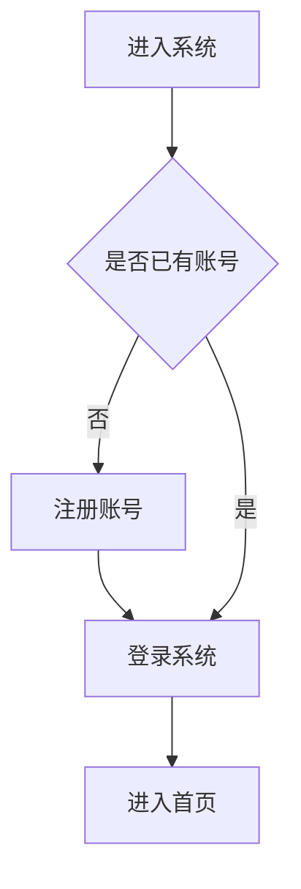

### 5.2 功能访问流程

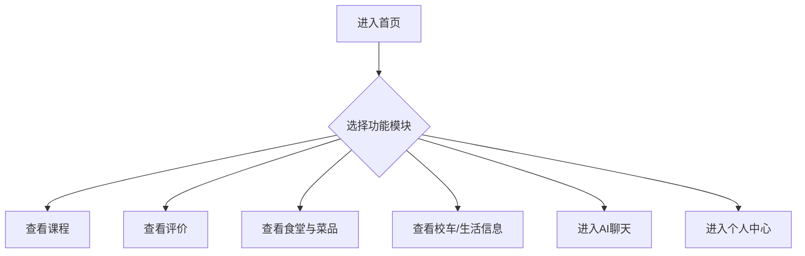

### 5.3 评论与个人中心流程

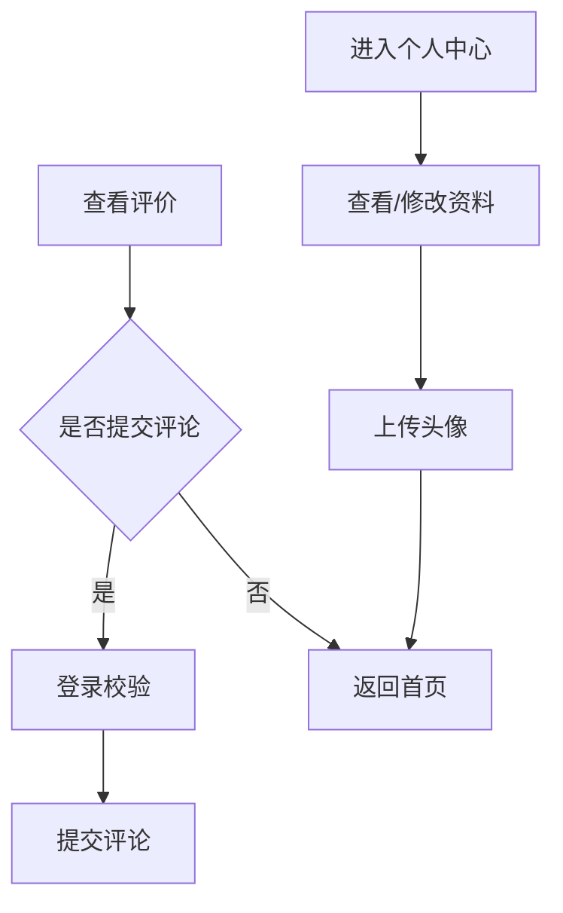

### 5.4 聊天流程

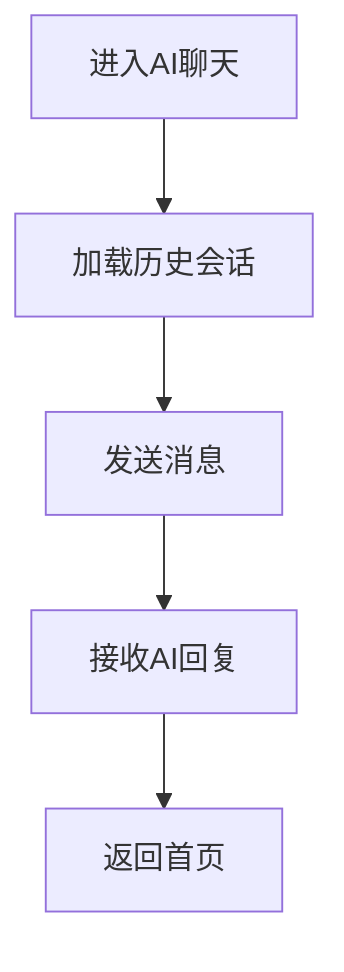

---

## 6. AI聊天流程图

### 6.1 聊天时序图

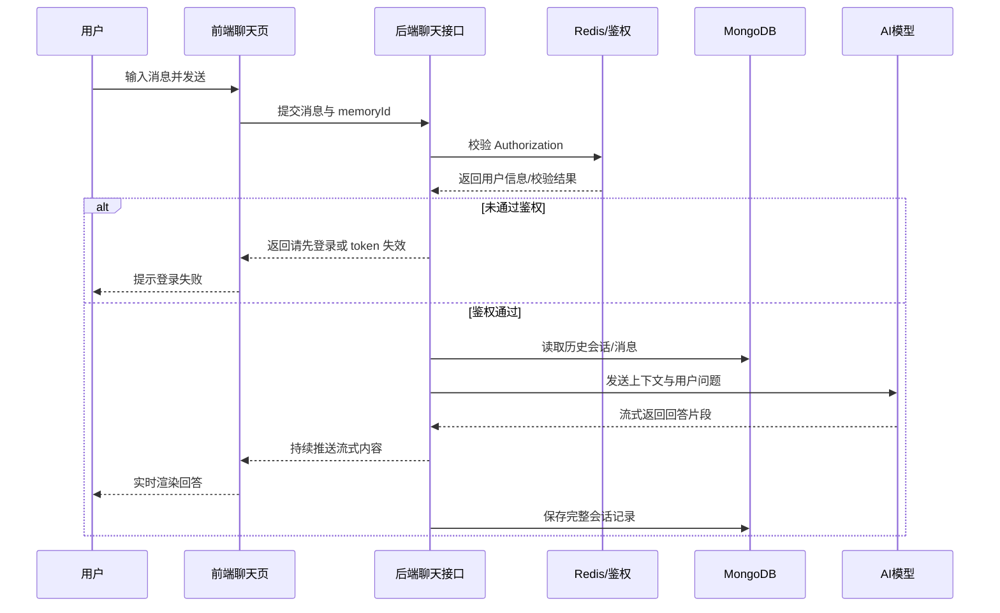

### 说明

- 聊天功能依赖登录态
- 流式回复由后端逐段返回，前端逐段拼接显示
- 聊天历史最终写入 MongoDB

---

## 7. 后台管理流程图

### 7.1 后台总流程图

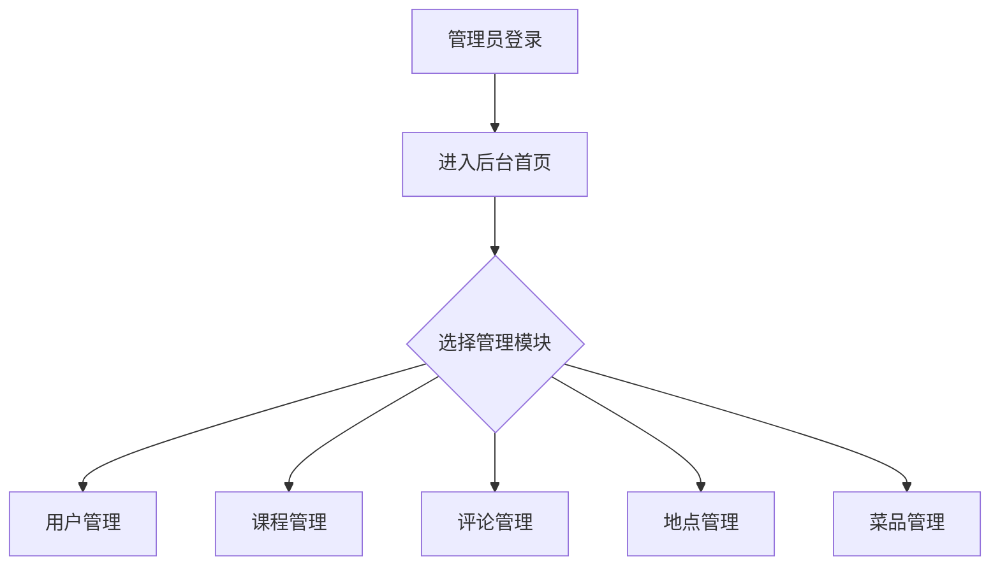

### 7.2 用户与课程管理流程

```mermaid
graph TD;
    D["用户管理"] --> D1["查询用户列表"];
    D1 --> D2["新增/编辑/删除用户"];
    D2 --> D3["提交接口并刷新列表"];

    E["课程管理"] --> E1["查询课程列表"];
    E1 --> E2["新增/编辑/删除课程"];
    E2 --> E3["提交接口并刷新列表"];
```

### 7.3 评论、地点与菜品管理流程

```mermaid
graph TD;
    F["评论管理"] --> F1["查询评论列表"];
    F1 --> F2["删除或维护评论"];
    F2 --> F3["提交接口并刷新列表"];

    G["地点管理"] --> G1["查询地点列表"];
    G1 --> G2["新增/编辑/删除地点"];
    G2 --> G3["提交接口并刷新列表"];

    H["菜品管理"] --> H1["查询菜品列表"];
    H1 --> H2["新增/编辑/删除菜品"];
    H2 --> H3["提交接口并刷新列表"];
```

---

## 8. 后端请求处理流程图

### 8.1 请求处理总流程

```mermaid
graph LR;
    A["前端发起请求"] --> B["Controller 接收"];
    B --> C{"是否需要鉴权"};
    C -- "是" --> D["AuthInterceptor 校验 token"];
    D --> E{"token 是否有效"};
    E -- "否" --> F["返回失败结果"];
    E -- "是" --> G["进入 Service"];
    C -- "否" --> G;
    F --> N["前端接收结果"];
```

### 8.2 数据访问分流图

```mermaid
graph LR;
    G["进入 Service"] --> H{"访问哪类数据"};
    H -- "结构化业务数据" --> I["Mapper / MySQL"];
    H -- "聊天消息数据" --> J["Repository / MongoDB"];
    H -- "文件资源" --> K["MinIO"];
    H -- "AI对话" --> L["AI Assistant / Model"];

    I --> M["封装 Result 返回"];
    J --> M;
    K --> M;
    L --> M;
    M --> N["前端接收结果"];
```

---

## 9. 使用建议

### 9.1 用于答辩展示

建议展示顺序：

1. 系统总览图
2. 前端子模块图
3. 后端子模块图
4. 前端总览图与页面层子图
5. 后端总览图与 Controller/Service 子图
6. 用户端流程图
7. AI聊天时序图
8. 后台管理流程图

### 9.2 用于开发说明

建议配合以下文档一起阅读：

- 需求分析说明书
- 详细设计文档
- 接口与数据需求文档
- 用户手册

### 9.3 后续可补充图表

后续还可以继续补充：

- 数据库 E-R 图
- 接口时序图
- 部署架构图
- 权限控制流程图
- 聊天存储结构图

---

## 10. 类图

### 10.1 核心业务类图

```mermaid
classDiagram
    class User {
        +id: Integer
        +username: String
        +password: String
        +userinfoId: Integer
    }

    class UserInfo {
        +id: Integer
        +nickname: String
        +phone: String
        +email: String
        +avatar: String
        +userType: Integer
        +userStatus: Integer
    }

    class Course {
        +id: Integer
        +courseName: String
        +teacher: String
        +description: String
        +commentCount: Integer
    }

    class CourseComment {
        +id: Integer
        +courseId: Integer
        +userId: Integer
        +userName: String
        +content: String
        +likeNum: Integer
    }

    class CanteenLocation {
        +id: Integer
        +name: String
    }

    class Dish {
        +id: Integer
        +dishName: String
        +price: BigDecimal
        +category: String
        +locationId: Long
        +locationName: String
    }

    User "1" --> "1" UserInfo : 关联
    Course "1" --> "0..*" CourseComment : 包含评论
    UserInfo "1" --> "0..*" CourseComment : 发布评论
    CanteenLocation "1" --> "0..*" Dish : 包含菜品
```

### 10.2 AI 服务类图

```mermaid
classDiagram
    class ChatMessageByUserController {
        +getList()
        +getMessages(memoryId)
        +streamingChat(chatForm)
    }

    class ChatMessageByUserService {
        +getList()
        +getMessages(memoryId)
        +streamingChat(chatForm)
    }

    class XiaoY {
        +chat(memoryId, userMessage)
        +fill(userClass, userMessage)
    }

    class xiaoYStreaming {
        +test(userMessage)
    }

    class XiaoYConfig {
        +chatMemoryProvider()
        +courseContentRetriever()
        +courseReviewContentRetriever()
        +multicontentRetrieverXiaoYPincone()
    }

    class ChatMemoryProvider {
        <<configuration>>
    }

    class ContentRetriever {
        <<configuration>>
    }

    class qwenChatModel {
        <<model>>
    }

    class qwenStreamingChatModel {
        <<model>>
    }

    ChatMessageByUserController --> ChatMessageByUserService : 调用
    ChatMessageByUserService --> xiaoYStreaming : 流式对话
    ChatMessageByUserService --> XiaoY : 普通对话

    XiaoY ..> ChatMemoryProvider : 使用
    XiaoY ..> ContentRetriever : 使用
    XiaoY ..> qwenChatModel : 使用

    xiaoYStreaming ..> ChatMemoryProvider : 使用
    xiaoYStreaming ..> ContentRetriever : 使用
    xiaoYStreaming ..> qwenStreamingChatModel : 使用

    XiaoYConfig ..> ChatMemoryProvider : 配置
    XiaoYConfig ..> ContentRetriever : 配置
```

### 说明

- 核心业务类图仅保留关键字段，突出实体关系，便于阅读
- AI 服务类图展示了控制层、服务层、AI 服务接口与配置对象之间的关系
- `chatMemoryProvider`、`contentRetriever`、`qwenStreamingChatModel` 等对象共同支撑 AI 问答能力
