# 小Y系统 UML 类图

> 基于源码结构整理，分为：系统整体类图（前后端）、实体类图、三层架构类图、AI 服务类图。

---

## 0. 系统整体类图（前后端）

表示系统核心数据模型、前端架构与后端架构之间的完整类关系。

### 0.1 核心数据模型（前后端共享）

前端 TypeScript 接口与后端 Java 实体字段一一对应，通过 HTTP JSON 传输。

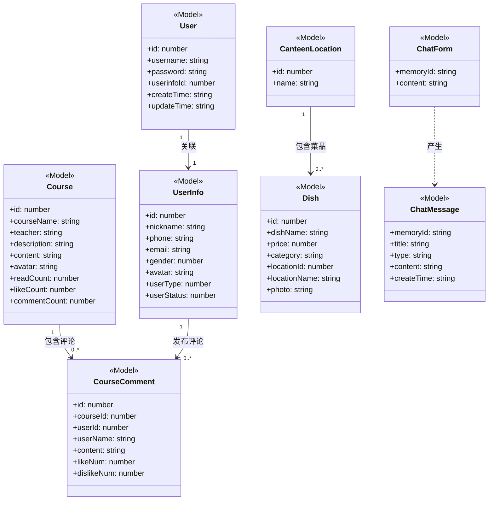

### 0.2 前端架构类图

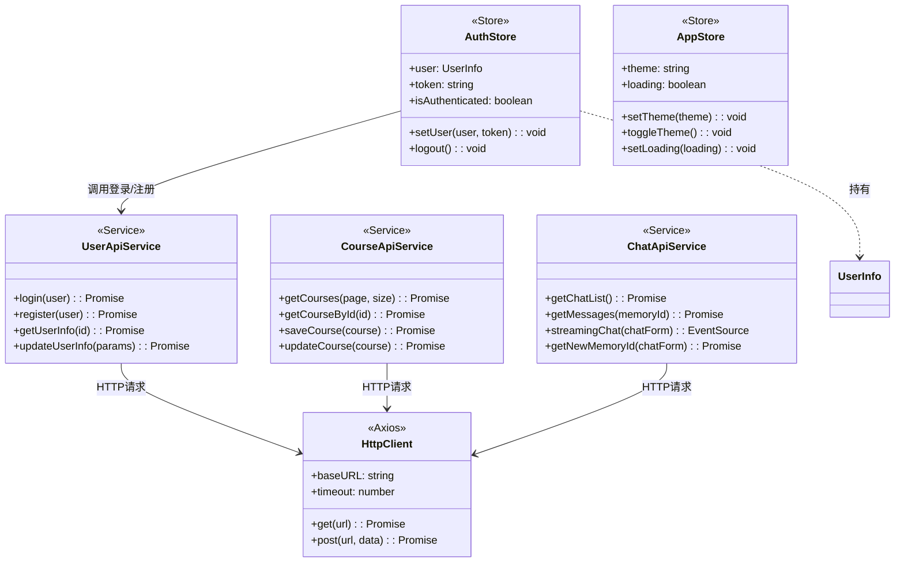

### 0.3 后端架构类图

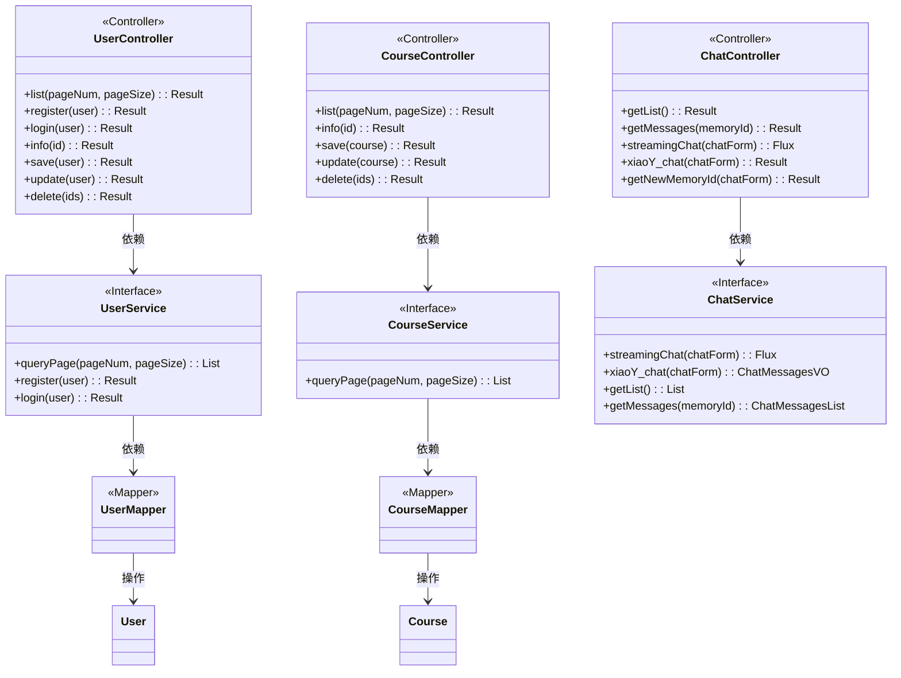

### 0.4 前后端交互关系

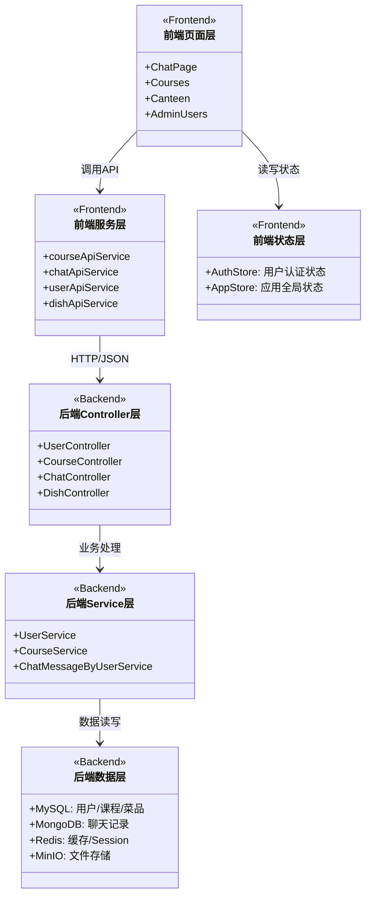

---

## 1. 实体类图

展示系统核心业务实体的属性及实体间的关联关系。

### 1.1 用户相关实体

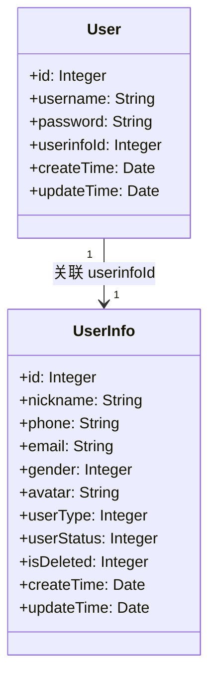

### 1.2 课程相关实体

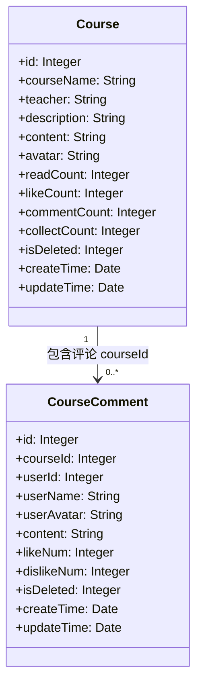

### 1.3 食堂相关实体

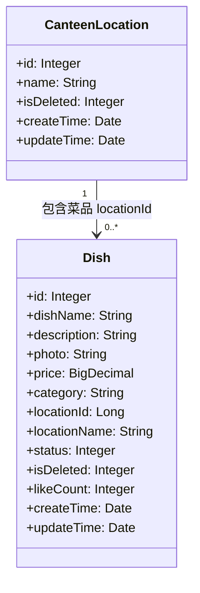

### 1.4 实体关系总览

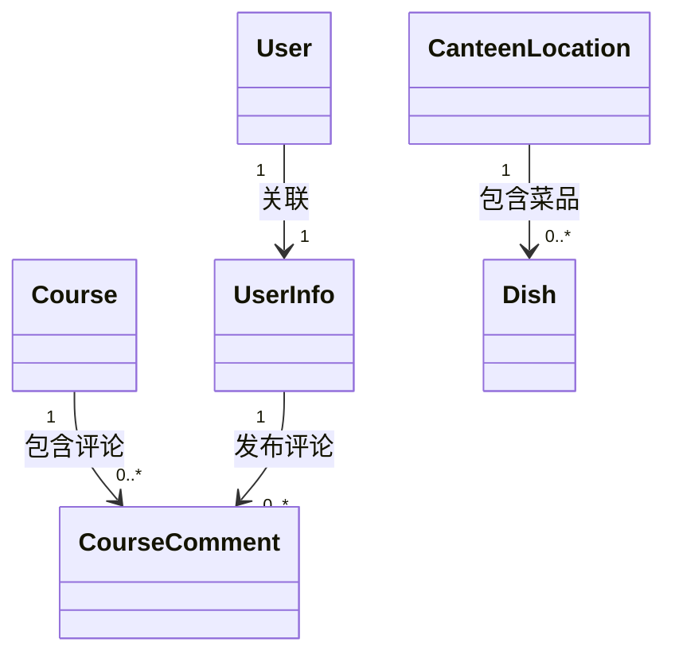

---

## 2. 三层架构类图

展示 Controller、Service 接口、Mapper 接口之间的类层次结构和依赖关系。

### 2.1 用户模块

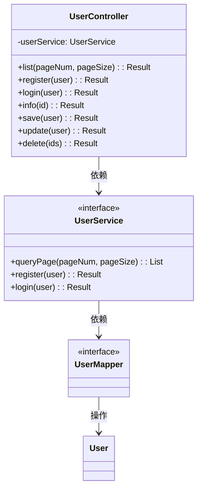

### 2.2 课程模块

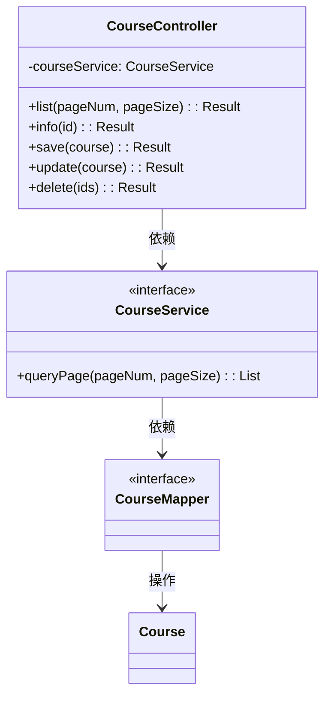

### 2.3 课程评论模块

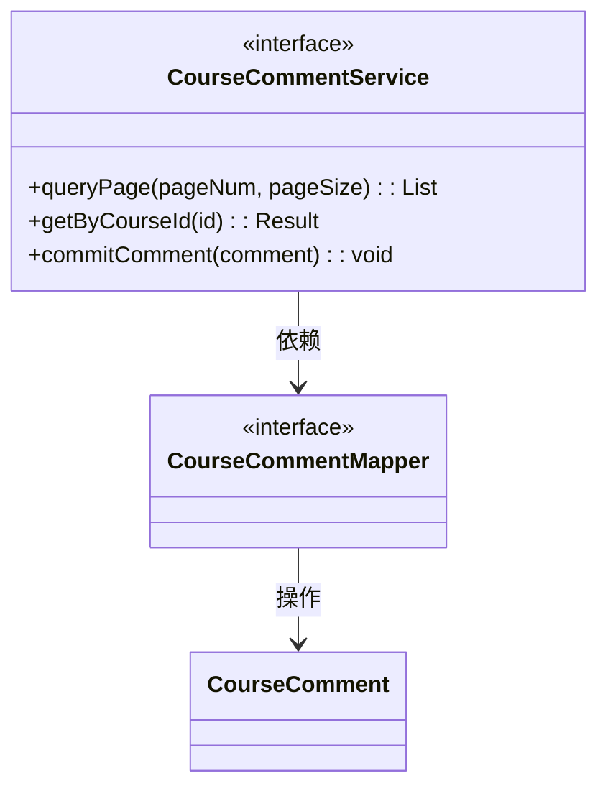

### 2.4 AI 聊天模块

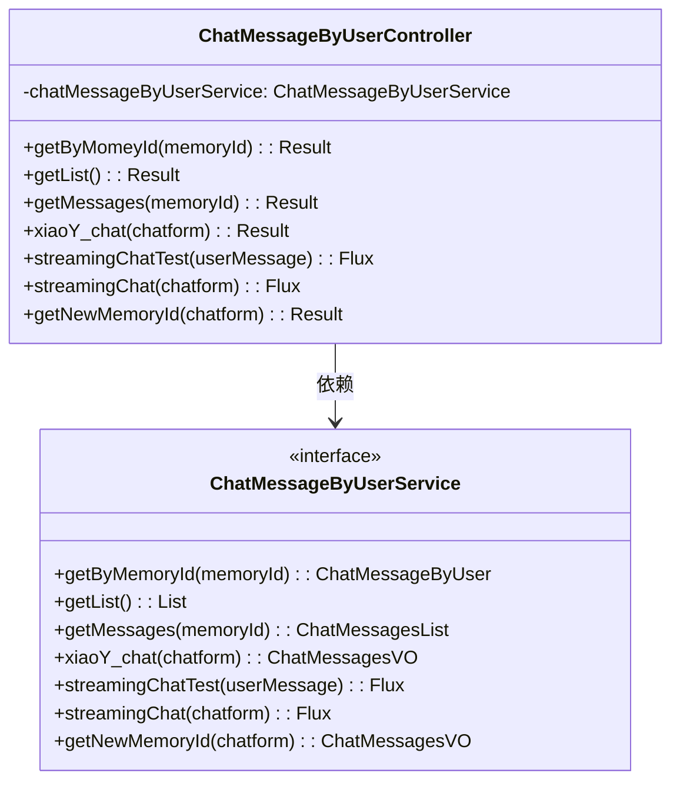

---

## 3. AI 服务类图

展示 LangChain4j AI 服务接口、配置类及其依赖关系。

### 3.1 AI 接口定义

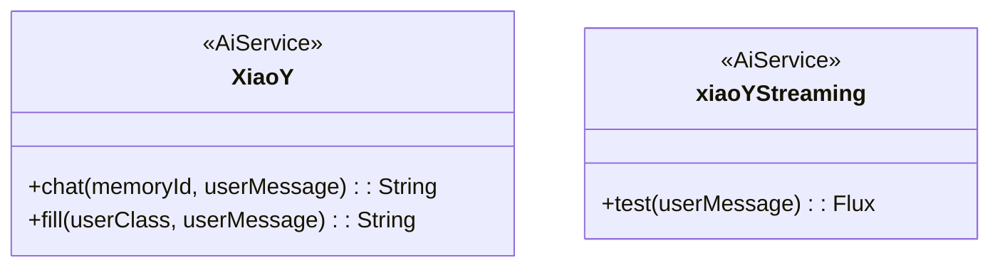

### 3.2 AI 配置类

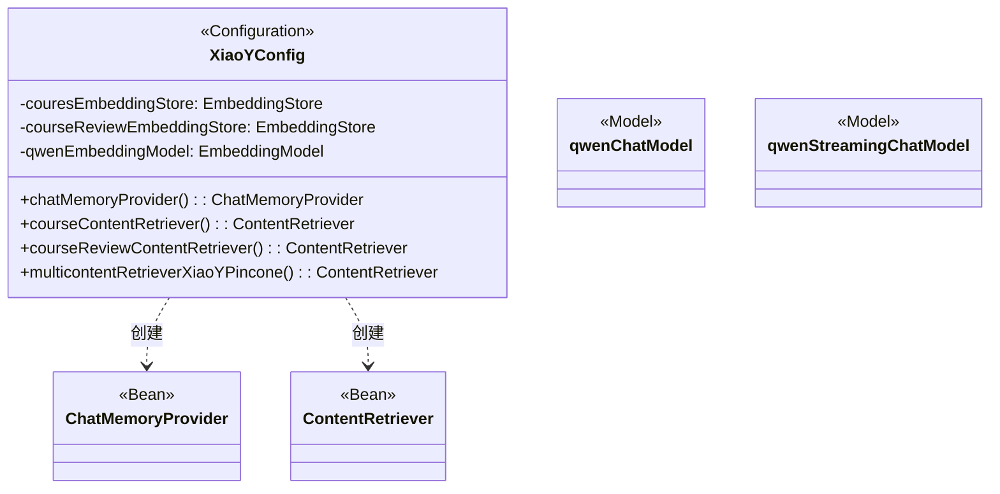

### 3.3 AI 服务完整调用链

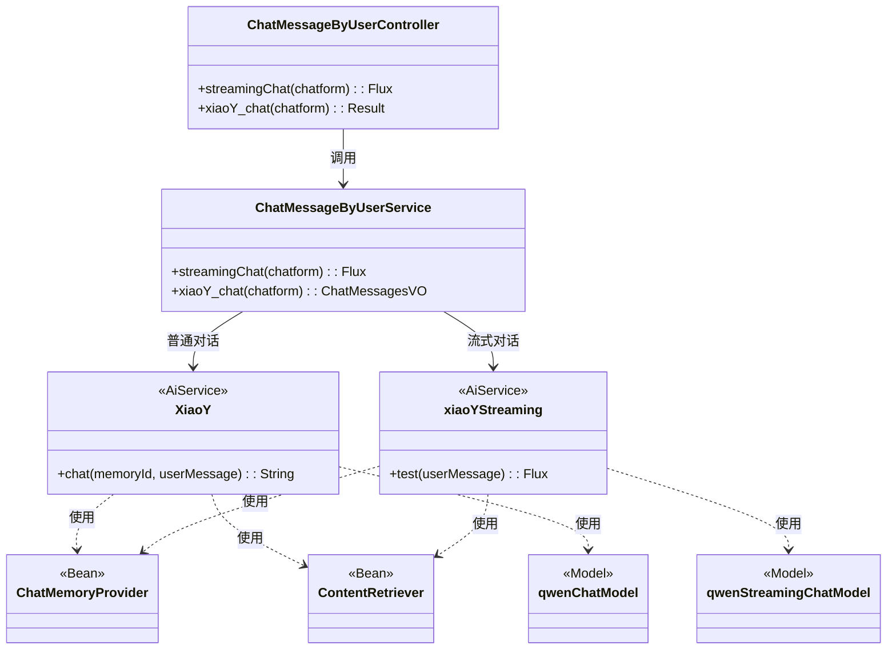

---

## 说明

| 符号 | 含义 |
|------|------|
| `-->` | 关联 / 依赖关系（有方向） |
| `..>` | 使用 / 依赖（虚线） |
| `"1" --> "0..*"` | 一对多关系 |
| `<<interface>>` | 接口类型 |
| `<<AiService>>` | LangChain4j AI 服务代理接口 |
| `<<Configuration>>` | Spring 配置类 |
| `<<Bean>>` | Spring 托管的 Bean 对象 |
| `<<Model>>` | AI 大模型适配器 |
